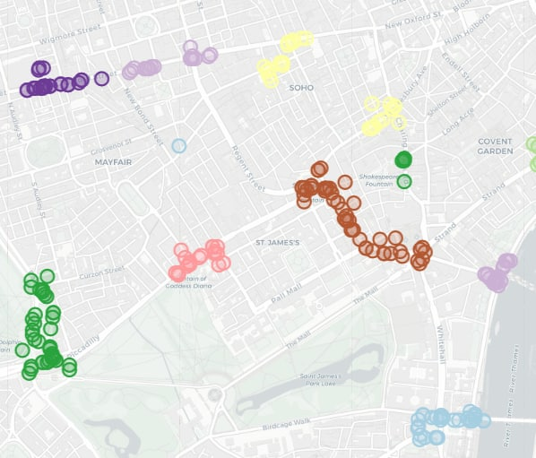

# ml-for-gis-hw
This repo contains a small project for the "ML for GIS" course taught at HSE.\
DBSCAN algorithm was implemented and applied to geographical data in the project. The results were plotted on an interactive map.

